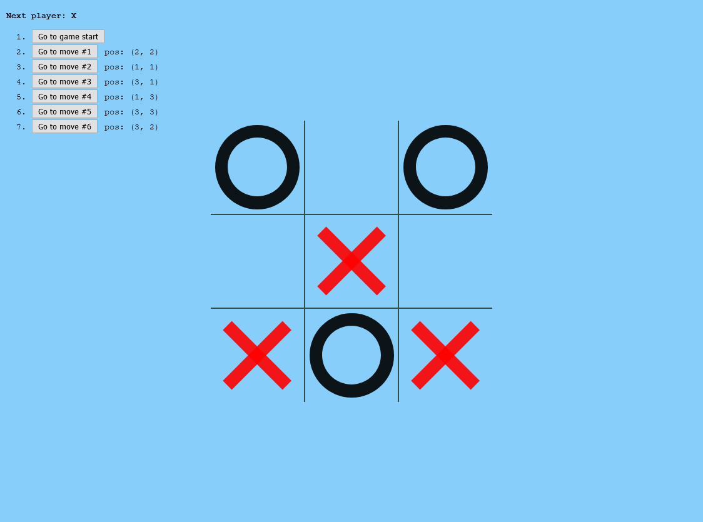

<p align="center">
  <a href="https://luvagu.github.io/react-tic-tac-toe">
    
    <h1 align="center">React Tic-Tac-Toe</h1>
  </a>
</p>

The old and beloved Tic-Tac-Toe of all time with handdy extra features.

## Main Features

- Play Tic-Tac-Toe
- Indicates when a player has won or there is a draw
- Stores the moves history during play
- Allows players to go back to previous moves
- Displays the location of each move as (row, column) in the move history
- Player's winning cells are highlighted
- X and O and hover events built entirely on CSS classes
- Play against the computer (coming soon)

## Getting Started

> Clone, Install dev dependencies and Run the dev server

```sh
git clone https://github.com/luvagu/react-tic-tac-toe.git

cd react-tic-tac-toe

npm install

npm start
```

> Build the production app

```sh
npm run build
```

## Optional

> Deploy to GitHub Pages for Free

> Must first activate this option on your own repo and set the `homepage` link in your `package.json`

> Learn more at https://guides.github.com/features/pages/

```sh
npm run deploy
```

Try the demo account at: https://luvagu.github.io/react-tic-tac-toe

Enjoy!
